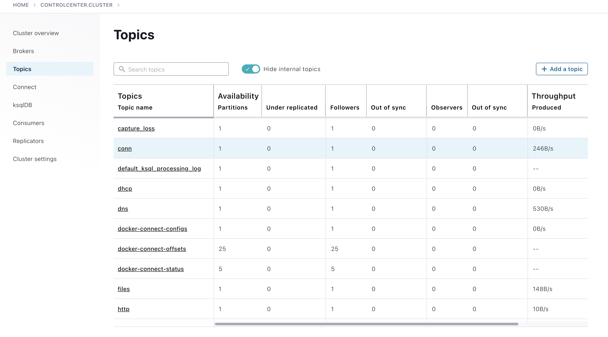

# ZStreams Ready Check

Okay there are two main parts that need to be up, running, and ready to go.

1. **Zeek with Kafka plugin:** see [Zeek + Kafka Setup](./Kafka_Setup.md)
1. **Kafka Broker/KSQL Setup:** As mentioned before I recommend Confluent <https://www.confluent.io/>. You don't strictly **need** to use the Confluent set of service but they really do make it easy and some of the examples will assume your using the docker-compose from Confluent or have a roughly equivalent **Kafka/Ksql** cluster setup. 

## All Systems Go?
Okay so with those two items all setup and ready, we can use the Confluent Control Center (or your equivalent) to make sure everything is up and running. 

- Open **<http://localhost:9021>** in your browser
- Click on **controlcenter.cluster**
- Click on **Topics**

You should see some of the familiar *Zeek* log names, like **conn**, **dns**, **dhcp**, etc...

If you see those topics you are ALL SET! Give yourself a pat on the back, enjoy some coffee/tea/beverage... you deserve it. After that you're ready to start the fun and exciting set of ZStream [Examples](../README.md) 

